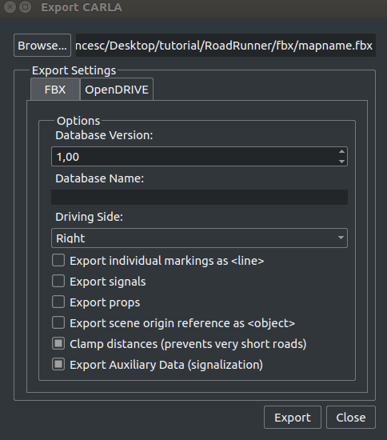
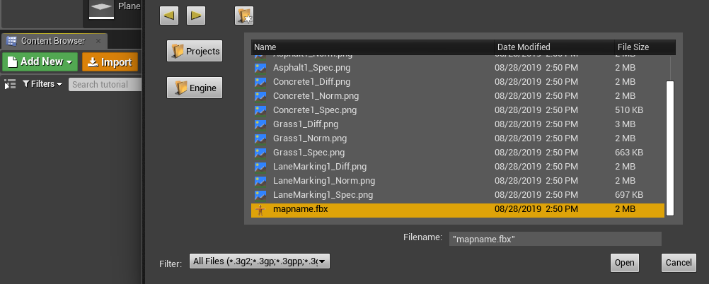
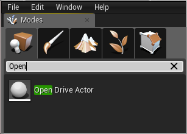
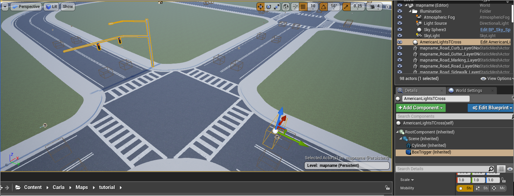
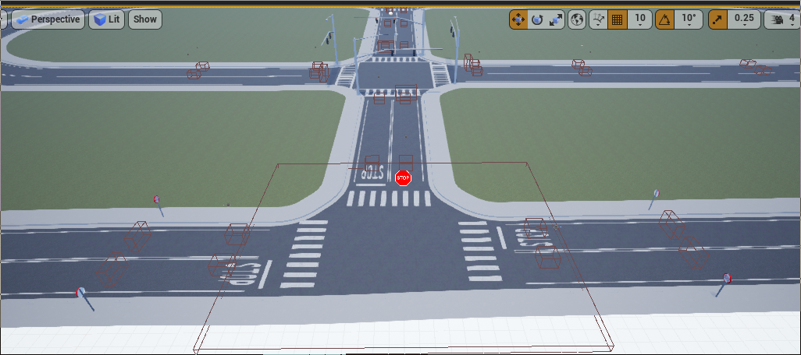
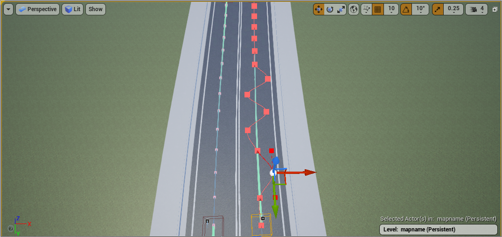
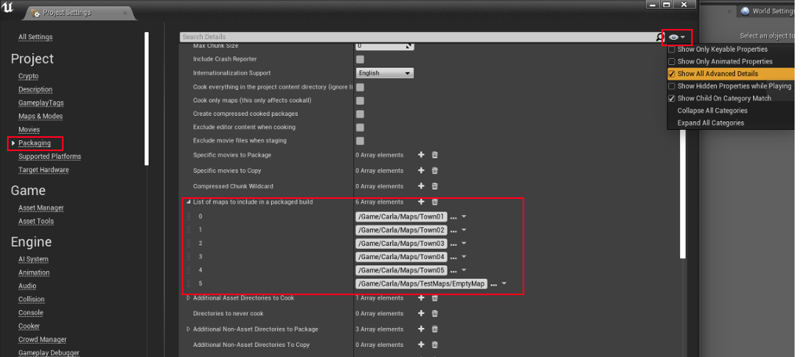

<h1>How to create and import a new map</h1>


## 1 Create a new map

Files needed:

* Binaries `.fbx` - All meshes you need to build the map, i.e., roads, lanemarking, sidewalk, ect.
* OpenDRIVE `.xodr` - Road network information that cars need to circulate on the map.

It is possible to modify an existing CARLA map, check out the [map customization][custommaplink]
tutorial.

[custommaplink]: /dev/map_customization

The following steps will introduce the RoadRunner software for map creation. If the map is
created by other software, go to this [section](#3-importing-into-unreal).

## 2 Create a new map with RoadRunner

RoadRunner is a powerful software from Vector Zero to create 3D scenes. Using RoadRunner is easy,
in a few steps you will be able to create an impressive scene. You can download
a trial of RoadRunner at VectorZero's web page.

<div class="vector-zero">
  <a href="https://www.vectorzero.io/"></a>
</div> <br>

Read VectorZero's RoadRunner [documentation][rr_docs] to install it and get started.

They also have very useful [tutorials][rr_tutorials] on how to use RoadRunner, check them out!

[rr_docs]: https://tracetransit.atlassian.net/wiki/spaces/VS/pages/740622413/Getting+Started

[rr_tutorials]: https://www.youtube.com/channel/UCAIXf4TT8zFbzcFdozuFEDg/playlists

!!! important
    Create the map centered arround (0, 0).

## 2.1 Validate the map

* Check that all connections and geometries seem correct.


* Visualize the OpenDRIVE road network by clicking on the `OpenDRIVE Preview Tool`
button and export.


!!! note
    The _OpenDrive Preview Tool_ button lets you test the integrity of the current map.
    If there is any error with map junctions, click on `Maneuver Tool`
    and `Rebuild Maneuver Roads` buttons.

!!! important
    Apply a 180 degree rotation before exporting `Tools > Transform Scene ... > Rotation`

## 2.2 Export the map

After verifying that everything is correct, it is time to export the map to CARLA.

  1. Export the scene using the CARLA option in the main menu:<br>
  `File > Export > CARLA (.fbx + .xml + .xodr)`.

  2. Leave `Export individual Tiles` _unchecked_, this will generate only one fbx
  file with all the pieces making it easier to keep track of the map.

      

      <br>

  3. Click `Export`.

This will generate a `mapname.fbx` and `mapname.xodr` files within others.

_For a more in-depth guide on how to use the exportation option,_
_check VectorZeros's [documentation][exportlink]._

[exportlink]: https://tracetransit.atlassian.net/wiki/spaces/VS/pages/752779356/Exporting+to+CARLA

## 3 Importing into Unreal

This section is divided into two. The first part introduces how to import a map from RoadRunner
and the second part how to import a map from other software that generates `.fbx` and `.xodr` files.

!!! important
    OpenDRIVE file `.xodr` should have the same name as the binary file `.fbx`
    i.e. `mapname.fbx` `mapname.xodr`.

We have also created a new way to import assets into Unreal,
check this [`guide`](../asset_packages_for_dist/)!

### 3.1 Importing from RoadRunner

#### 3.1.1 Plugin Installation

RoadRunner provides a series of plugins that make the importing simpler.

1. Locate the plugins under RoadRunner's installation folder:<br>
   `/usr/bin/VectorZero/Tools/Unreal/Plugins`.

2. Copy those folders to the CarlaUE4 plugins directory: `/carla/Unreal/CarlaUE4/Plugins/`.

3. Rebuild the plugin.

##### Rebuild on Windows

1. Generate project files.

    * Right-click the `.uproject` file and `Generate Visual Studio project files`.

2. Open the project and build the plugins.

##### Rebuild on Linux

```sh
> UE4_ROOT/GenerateProjectFiles.sh -project="carla/Unreal/CarlaUE4/CarlaUE4.uproject" -game -engine
```

Finally, restart Unreal Engine and make sure the checkbox is on for both plugins `Edit > Plugins`.


#### 3.1.2 Importing

  1. Import the _mapname.fbx_ file to a new folder under `/Content/Carla/Maps`
   with the `Import` button.

      

      <br>

  2. Set `Scene > Hierarchy Type` to _Create One Blueprint Asset_ (selected by default).
  3. Set `Static Meshes > Normal Import Method` to _Import Normals_.

      

      <br>

  4. Click `Import`.

  5. Save the current level `File > Save Current As...` > _mapname_.

The new map should now appear next to the others in the Unreal Engine _Content Browser_.


That's it! The map is ready!

### 3.2 Importing from the files

This is the generic way of importing maps into Unreal.

1. Create a new level with the **Map** name in Unreal `Add New > Level` under `Content/Carla/Maps`.
2. Copy the Illumination folder and content from the BaseMap `Content/Carla/Maps/BaseMap`
and paste it in the new level, otherwise, the map will be in the dark.


#### 3.2.1 Binaries (.fbx)

1. Import the _mapname.fbx_ file to a new folder under `/Content/Carla/Maps`
  with the `Import` button. Make sure the following options are unchecked:

    * Auto Generate Collision
    * Combine Meshes
    * Force Front xAxis
    * Normal Import Method - _Import Normals_

    <br>

2. Check the following options:

    * Convert Scene Unit
    * _If you want to import materials and textures:_
        * Material Import Method - _Create new materials_
        * Import Textures

    

    <br>

    Once everything is loaded up, you should end with several static Meshes in the folder
    you have selected.

3. Drag them all into the level.

    

    <br>

4. When unreal finishes loading, center the meshes at point (0, 0, 0) and you will have
  your map in Unreal! Congratulations!

    

    <br>

5. Lastly, for the **semantic segmentation ground truth**, move the static meshes imported
 under `Content/Carla/Maps/mapfolder` to `Carla/Static` subsequent folders:

    * `Terrain/mapname`
    * `Road/mapname`
    * `RoadLines/mapname`

```sh
Content
└── Carla
    ├── Blueprints
    ├── Config
    ├── Exported Maps
    ├── HDMaps
    ├── Maps
    └── Static
        ├── Terrain
        │   └── mapname
        │       └── Static Meshes
        │
        ├── Road
        │   └── mapname
        │       └── Static Meshes
        │
        └── RoadLines  
            └── mapname
                └── Static Meshes
```


#### 3.2.2 OpenDRIVE (.xodr)

1. Copy the (.xodr) file inside the `Content/Carla/Maps/OpenDrive` folder.
2. Open the Unreal level and drag the _Open Drive Actor_ inside the level.
It will read the level's name, search the Opendrive file with the same name and load it.



And that's it! Now the road network information is loaded into the map.

## 4. Setting up traffic behavior

Once everything is loaded into the level, it is time to create traffic behavior.

1. Click on the _Open Drive Actor_.
2. Check the following boxes in the same order:
    * Add Spawners
    * (Optional) On Intersections (For more spawn points)
    * Generate Routes

This will generate a bunch of _RoutePlanner_ and _VehicleSpawnPoint_ actors that make
it possible for vehicles to spawn and go in autopilot mode.

## 4.1 Traffic lights and signs

To regulate the traffic, traffic lights and signs must be placed all over the map.

1. Drag _traffic light / sign actors_ into the level and place them.

2. Adjust the _[`trigger box`][triggerlink]_ of each traffic light / sign
 until it covers the road it affects.
  [triggerlink]: ../python_api/#carla.TrafficSign.trigger_volume

    

    <br>

3. For traffic lights in junctions, drag a _traffic light group actor_ into the level and assign
  all traffic lights involved.

    

These last steps may require some trial and error. _Traffic light timing_ and _traffic trigger boxes_
might need some tweaking and testing to fit perfectly into the city.



> _Example: Traffic Signs, Traffic lights and Turn based stop._

## Tips and Tricks

* Traffic light group works by Rotating which of the involved traffic light is green each moment.
 You can configure the timing the Lights stays in green `GreenTime`, the time it stays yellow
 `YellowTime`, and the time it takes between one traffic light goes red and the next one
 goes green `ChangeTime`.

<div style="text-align:center"></div>
<br>

* You can add a vehicle spawn point. This should be placed 2 to 3 meters above a Route Planner's
 trigger box and oriented as the route shows. When the vehicle falls, it will hit the trigger box
 and the autopilot will take control of the vehicle.

  

* When you check `Generate Routes` in Open Drive Actor, it generates the road network but it won't
  show individual planners. In order to show those points, do the following:

    1. Select all `RoutePlanner` actors
    2. Move them
    3. Press `ctr + z` and they will show up on the map.
    

* OpenDRIVE routes can be manually modified.

  

* In order to add the map to the Unreal packaging system, go to:  
  `Edit > Project Settings > Project > Packaging > Show Advanced > List of maps to include...` <br>
  Then add the level to the array.

  

* To change default materials and use the ones that come with CARLA at:<br>
`Content/Carla/Static/GenericMaterials`.
    * Quick shorts to find materials and assets:
        * `Right-click on the Asset > Browse to Asset`
        * `Right-click on the Material > Asset Actions > Select Actors Using This Asset`
